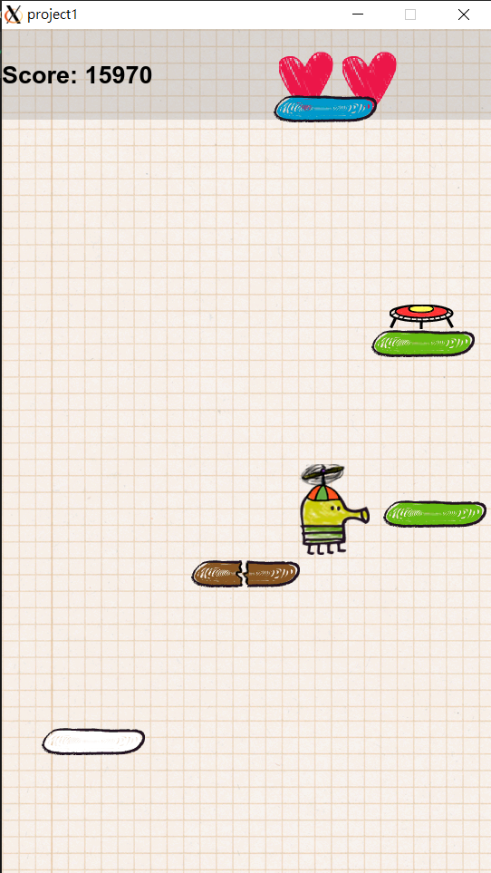

# Doodle Jump Game Writeen in C++ Using Qt5

## Setup
Environment: Cygwin64

Run the following code in cygwin64 terminal:
```bash
startxwin &
export DISPLAY=:0.0
./project1.exe
```

### Gameplay Screenshot

